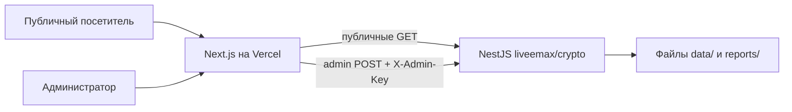

# ТЗ: публичная панель для `liveemax/crypto`

## 0. Статус и назначение

Это утверждённое ТЗ на отдельный frontend-проект для backend-репозитория
`liveemax/crypto`.

Панель публично показывает вселенную криптопроектов и последний ranking.
Обычные посетители только читают данные и используют табличные фильтры.
Изменяющие действия доступны после ввода admin-пароля.

Frontend разворачивается на Vercel и живёт в новом отдельном репозитории.
Рабочее имя — `crypto-dashboard`; имя можно заменить без изменения архитектуры
или HTTP-контрактов.

Это исследовательский интерфейс, не торговый терминал. Он не выдаёт рекомендации
покупать или продавать и не добавляет собственные расчёты поверх backend.

«Все проекты» в этом ТЗ означает всех кандидатов текущего `UniverseSnapshot`
backend (сейчас это формируемая сервисом вселенная), а не все существующие монеты
крипторынка без ограничения.

---

## 1. Как выполнять это ТЗ

Один пронумерованный шаг выполняется в одном окне Codex.

Перед каждым backend-шагом Codex обязан:

1. открыть `liveemax/crypto` на актуальной ветке;
2. полностью прочитать `CLAUDE.md`;
3. прочитать этот шаг и связанные текущие файлы;
4. выполнить только этот шаг;
5. запустить указанную приёмку;
6. перечислить изменённые и созданные файлы;
7. остановиться и ждать подтверждения пользователя.

Перед каждым frontend-шагом Codex обязан прочитать `CLAUDE.md` нового frontend-
репозитория и это ТЗ. Не создавать заглушки следующих шагов и не устанавливать
библиотеки «на будущее».

Универсальный запрос для нового окна Codex:

```text
Прочитай CLAUDE.md и файл с ТЗ панели полностью.
Выполни только ШАГ <НОМЕР>.
Не переходи к следующему шагу.
После реализации запусти всю обязательную приёмку шага, перечисли изменённые
файлы, риски и результаты проверок. Затем остановись.
```

Если код противоречит ТЗ, Codex сначала сообщает точное противоречие и предлагает
минимальное решение. Молчаливая смена утверждённого контракта запрещена.

### 1.1. Жёсткий протокол окон

Для каждого шага используется отдельное новое окно Codex:

1. пользователь открывает новое окно и отправляет стартовый запрос этого шага;
2. Codex читает репозиторий, реализует только этот шаг и выполняет автоматические
   проверки;
3. если нужна работающая среда или браузер, Codex пишет
   `ОЖИДАЮ РУЧНУЮ ПРИЁМКУ ШАГА N` и не завершает шаг;
4. пользователь выполняет перечисленные запросы и отправляет пакет
   `РУЧНАЯ ПРИЁМКА ШАГА N` в то же окно;
5. Codex сверяет ответы с чек-листом, сам проверяет доступные файлы/tests и
   завершает окно одним статусом:
   - `ACCEPTED_STEP_N` — всё прошло;
   - `FAILED_STEP_N` — обнаружен дефект в границах шага;
   - `BLOCKED_STEP_N` — нет runtime, env или другого внешнего условия;
6. окно закрывается. Шаг N+1 всегда начинается в новом окне.

Codex запрещено:

- начинать следующий шаг после `ACCEPTED_STEP_N`;
- принимать шаг только по словам «вроде работает»;
- требовать от пользователя содержимое файлов, лежащих в GitHub;
- просить прислать password, cookie, admin key или полный многомегабайтный JSON;
- объявлять `ACCEPTED`, если обязательная ручная проверка не выполнена;
- исправлять дефекты следующего шага «заодно».

Если ручная проверка не нужна, Codex всё равно завершает текущий шаг и останавливается.
Новое окно обязательно для следующего номера.

---

## 2. Зафиксированные решения

- Новый чистый frontend-репозиторий, отдельно от `liveemax/crypto`.
- Next.js App Router, React, TypeScript strict, Ant Design, SWR и Sass Modules.
- Использовать последний безопасный patch линии Next.js `14.2.x`, а не фиксировать
  версию `14.2.3` только потому, что она была в примере.
- Сайт публичен для чтения без регистрации.
- Две вкладки: `Universe` и `Ranking`.
- Таблица Universe расширенная: рынок, экономика, tokenomics и alpha.
- Все посетители используют обычные GET-фильтры таблиц.
- `screen`, `alpha`, обновления данных и новый ranking запускает только admin.
- Admin-доступ открывается вводом одного пароля; весь сайт паролем не закрывается.
- Любой POST из интерфейса требует подтверждения.
- Browser не получает backend admin-key и не обращается к NestJS напрямую.
- Запросы браузера идут только в Next.js Route Handlers.
- Кастомные стили компонентов — только `styles.module.scss`.
- В первой версии нет графиков, редактора профилей, sensitivity, Markdown-отчётов,
  ручных overrides и многопользовательских персональных фильтров.

---

## 3. Неподвижные инварианты

### 3.1. Backend остаётся источником истины

Frontend не считает и не исправляет:

- `tier`, `passed`, `alphaQualified`, `businessScaleScore`;
- valuation, tokenomics, sectorPosition и composite;
- проценты, перцентили, ranking tiers и hard filters;
- свежесть источника и coverage.

Frontend только форматирует полученные значения. Исправлять расхождение
клиентской формулой запрещено.

### 3.2. `null` не является нулём

Любой `null` показывается как `—` с подсказкой `Нет данных`. Нельзя превращать
его в `0`, `0%`, пустую строку, последнее место или отрицательную оценку.
`known_zero` показывается как измеренный ноль.

### 3.3. Происхождение не теряется

Рядом со списками сохраняются `universeVersion`, `builtAt`, `activeFilters` и
`asOf` из `context`. В карточке токена ссылки и даты берутся только из backend.
URL с ключами никогда не выводятся.

### 3.4. Списки остаются серверными

Frontend не скачивает все 1300 строк для локальной фильтрации. Поиск, фильтры,
сортировка и пагинация выполняются backend до `offset/limit`. Начальный размер
страницы — 50, максимум — 200.

### 3.5. Одна сетевая задача

`GET /status` — единственный источник прогресса. Пока `job.state=running`, UI
не позволяет запустить другой POST. Нельзя создавать второй клиентский job state
или считать задачу завершённой по таймеру.

### 3.6. Ranking — тиры, не точная инвестиционная очередь

UI подчёркивает A/B/C/watchlist и не называет номер строки инвестиционным рангом.
Watchlist не прячется. Детерминированная сортировка внутри тиров не превращается
в рекомендацию.

### 3.7. Публичность не означает публичные мутации

GET остаются публичными. Любой POST, PUT, PATCH или DELETE backend требует
служебный admin-key. Диалог подтверждения в browser не считается защитой.

---

## 4. Целевая схема



Правила границы:

- browser вызывает только same-origin `/api/...` нового frontend;
- `CRYPTO_API_BASE_URL` и `CRYPTO_ADMIN_API_KEY` существуют только на сервере;
- публичный proxy не принимает произвольный backend path или URL;
- admin proxy проверяет подписанную HttpOnly-cookie, затем добавляет
  `X-Admin-Key` к запросу NestJS;
- NestJS сам проверяет `X-Admin-Key`: Next.js не заменяет защиту backend.

---

# ШАГ 1 — Backend: запросы для таблиц

**Репозиторий:** `liveemax/crypto`.

**Результат окна:** frontend ищет, фильтрует и сортирует Universe и Ranking
страницами, не скачивая полные массивы.

## Стартовый запрос для нового окна Codex

```text
@GitHub liveemax/crypto

Прочитай CLAUDE.md и приложенный файл tz-crypto-dashboard.md полностью.
Выполни только ШАГ 1 — Backend: запросы для таблиц.
Не выполняй защиту мутаций и не создавай frontend.

После реализации сам запусти unit, e2e, build и git diff --check.
Если runtime доступен, выполни ручные HTTP-проверки шага сам.
Если runtime недоступен, напиши ровно:
ОЖИДАЮ РУЧНУЮ ПРИЁМКУ ШАГА 1
и перечисли только недостающие runtime-ответы.

После проверки верни ACCEPTED_STEP_1, FAILED_STEP_1 или BLOCKED_STEP_1.
Не переходи к шагу 2.
```

## 1.1. Расширить `GET /universe`

Сохранить существующие параметры и добавить:

- `q?: string` — case-insensitive поиск по `name`, `ticker`, `coingeckoId`;
- `order?: asc|desc` — явное направление сортировки.

Правила `q`:

- trim на входе;
- пустая строка равна отсутствующему фильтру;
- максимальная длина 100 символов;
- совпадение по подстроке;
- поиск выполняется до сортировки и пагинации.

Расширить allowlist `sort` полями summary:

- `rank`;
- `mcapCalcUsd`;
- `vol24hUsd`;
- `tvlUsd`;
- `revenue12mUsd`;
- `holdersRevenue12mUsd`;
- `holderYieldPct`;
- `pRev`;
- `pFees`;
- `overhangPct`;
- `unlock12mPct`;
- `netHolderYieldPct`;
- `businessScaleScore`.

Default без `order`:

- `rank`, `pRev`, `pFees` — `asc`;
- остальные числовые поля — `desc`.

При любой сортировке:

- `null` всегда в конце, даже при `asc`;
- равные значения стабилизируются по `rank`, затем `coingeckoId`;
- исходный массив `UniverseView.candidates` не мутируется.

Существующие `passedOnly`, `tier`, `sector`, `view`, `offset`, `limit` сохраняются.
Порядок обработки:

```text
active selection → passedOnly/tier/sector/q → sort/order → pagination → summary/full
```

## 1.2. Добавить `GET /universe/options`

Ответ:

```ts
interface UniverseOptionsResponse {
  context: ResponseContext;
  sectors: string[];
}
```

- `sectors` строится по всей текущей `UniverseView.candidates`, не по странице и
  не только по `passed`;
- `null` не входит;
- нормализация соответствует текущей семантике `sector`;
- значения уникальны и сортируются лексикографически;
- `context` обязателен, потому что список зависит от snapshot.

Создать отдельный DTO с реальным Swagger example.

## 1.3. Расширить `GET /ranking/latest`

Добавить параметры:

- `q?: string` — поиск по `evaluation.name`, `evaluation.ticker`,
  `evaluation.coingeckoId`;
- `rankTier?: A|B|C|watchlist`;
- `dataTier?: yield|economics|pool|rejected`;
- `comparisonGroup?: string`;
- `sort?: tier|composite|valuation|tokenomics|sectorPosition|dataQuality|name`;
- `order?: asc|desc`.

Default: `sort=tier`. Порядок тиров: `A`, `B`, `C`, `watchlist`; внутри тира —
`composite desc`, затем `coingeckoId asc`. Это детерминированный вывод внутри
тиров, не точный инвестиционный ранг.

Для `sort=tier` default `order=asc`: `A → B → C → watchlist`. Явный `desc`
разворачивает только порядок тиров; внутри каждого тира `composite desc`
сохраняется.

Для score/composite/dataQuality `null` всегда в конце. Фильтры и поиск выполняются
до пагинации. `tiers` верхнего уровня остаётся totals всего run;
`pagination.total` отражает отфильтрованный набор. Сохранённый
`RankingRun.candidates` нельзя сортировать или фильтровать in-place.

## 1.4. Добавить `GET /ranking/options`

Ответ:

```ts
interface RankingOptionsResponse {
  context: ResponseContext;
  runId: string;
  comparisonGroups: string[];
}
```

Список строится по кандидатам последнего ranking run, исключает `null`, уникален
и отсортирован. Если ranking ещё нет, вернуть текущую нормализованную ошибку
`ranking_missing` с `nextAction`, не пустой список.

## 1.5. Архитектура

- DTO входа остаются в `api/`.
- Типы query/response — в доменных `*.types.ts`.
- Поиск/фильтрация/сортировка — чистые функции в доменном слое.
- Тесты — только в `test/`.
- Не менять формулы, профили, `UniverseView`, сохранённые run или snapshots.
- Не добавлять БД, сеть, LLM или клиентские поля в backend DTO.

## Обязательная приёмка шага 1

- [ ] `q` ищет name, ticker и coingeckoId без учёта регистра.
- [ ] Фильтрация выполняется до пагинации; `pagination.total` полный.
- [ ] `null` в конце при `asc` и `desc`.
- [ ] Одинаковые запросы дают одинаковый порядок.
- [ ] `passedOnly=false` возвращает прошедшие и отсеянные строки.
- [ ] `/universe/options` не зависит от текущей страницы.
- [ ] Ranking-фильтры не меняют глобальные `tiers` run.
- [ ] `view=summary|full`, default limit 50 и max 200 не сломаны.
- [ ] Неверные `sort`, `order`, tier и `limit=201` дают нормализованную 4xx.
- [ ] OpenAPI содержит новые enum и DTO.
- [ ] Unit, e2e, build и полный test зелёные.

Проверочные HTTP-запросы:

```text
GET /universe?passedOnly=false&q=aave&sort=mcapCalcUsd&order=desc&offset=0&limit=50
GET /universe?passedOnly=false&sector=lending&tier=yield&sort=pRev&order=asc&limit=50
GET /universe/options
GET /ranking/latest?q=aave&sort=composite&order=desc&limit=50
GET /ranking/latest?rankTier=A&sort=composite&order=desc&limit=50
GET /ranking/options
GET /universe?sort=not-a-field
GET /ranking/latest?order=sideways
GET /ranking/latest?limit=201
```

Передать Codex статусы, `context`, `pagination`, первые две строки успешных
ответов, options и тела негативных ответов. API-ключи и многостраничные ответы
не передавать.

### Что пользователь выполняет и передаёт Codex

В Swagger или через curl выполнить запросы из блока выше. Сначала выполнить
`GET /status`. Если `GET /ranking/latest` отвечает `ranking_missing`, при
готовой universe и отсутствии running job один раз выполнить:

```text
POST /ranking/run
Content-Type: application/json

{"profileId":"deep-value"}
```

После этого повторить ranking GET. Если runtime-данных нет, ничего не
придумывать: передать status и Codex обязан вернуть `BLOCKED_STEP_1`.

Отправить в то же окно:

```text
РУЧНАЯ ПРИЁМКА ШАГА 1

1. GET /status
   HTTP:
   universeVersion:
   activeFilters:

2. GET /universe?passedOnly=false&q=aave&sort=mcapCalcUsd&order=desc&offset=0&limit=50
   HTTP:
   context:
   pagination:
   первые 2 items:

3. GET /universe?passedOnly=false&sector=lending&tier=yield&sort=pRev&order=asc&limit=50
   HTTP:
   context:
   pagination:
   первые 2 items или []:

4. GET /universe/options
   HTTP:
   полный небольшой ответ:

5. GET /ranking/latest?q=aave&sort=composite&order=desc&limit=50
   HTTP:
   runId:
   context:
   pagination:
   первые 2 items:

6. GET /ranking/latest?rankTier=A&sort=composite&order=desc&limit=50
   HTTP:
   tiers:
   pagination:
   первые 2 items или []:

7. GET /ranking/options
   HTTP:
   полный небольшой ответ:

8. Негативные запросы
   /universe?sort=not-a-field — HTTP и body:
   /ranking/latest?order=sideways — HTTP и body:
   /ranking/latest?limit=201 — HTTP и body:

Секретов нет. Полные большие items не прикладывал.
```

Codex принимает шаг только если сам сопоставил ответы с unit/e2e и вернул
`ACCEPTED_STEP_1`.

**СТОП.**

---

# ШАГ 2 — Backend: защита всех мутаций

**Репозиторий:** `liveemax/crypto`.

**Зависимости:** шаг 1.

**Результат окна:** публичные GET работают без ключа, любой изменяющий метод
требует `X-Admin-Key`.

## Стартовый запрос для нового окна Codex

```text
@GitHub liveemax/crypto

Это новое окно. ШАГ 1 уже принят.
Прочитай CLAUDE.md и приложенный tz-crypto-dashboard.md полностью.
Выполни только ШАГ 2 — Backend: защита всех мутаций.
Не создавай frontend и не меняй бизнес-формулы.

Сам запусти unit, e2e, build и git diff --check. Никогда не печатай значение
ADMIN_API_KEY. Если для runtime-проверки нужны ответы пользователя, напиши:
ОЖИДАЮ РУЧНУЮ ПРИЁМКУ ШАГА 2

После проверки верни ACCEPTED_STEP_2, FAILED_STEP_2 или BLOCKED_STEP_2.
Не переходи к шагу 3.
```

## 2.1. Конфигурация

Добавить server-only env:

```dotenv
ADMIN_API_KEY=<случайная строка минимум 32 символа>
CORS_ORIGINS=https://example.vercel.app
```

Правила:

- пустой или слишком короткий `ADMIN_API_KEY` — ошибка запуска, не тихое
  отключение защиты;
- secret читается через `@nestjs/config`;
- secret не логируется и не возвращается в errors, Swagger examples или status;
- `.env.example` содержит placeholder, не рабочее значение;
- `CORS_ORIGINS` остаётся comma-separated allowlist без `*`.

## 2.2. Глобальный guard

Создать один глобальный guard:

- `GET`, `HEAD`, `OPTIONS` пропускаются без ключа;
- `POST`, `PUT`, `PATCH`, `DELETE` требуют один header `X-Admin-Key`;
- missing/invalid key → HTTP 401;
- сравнение constant-time и безопасно для строк разной длины;
- guard регистрируется один раз через `APP_GUARD`;
- контроллеры не копируют проверку.

Тело 401:

```json
{
  "code": "admin_unauthorized",
  "message": "Для изменяющего запроса требуется доступ администратора.",
  "details": null,
  "nextAction": null
}
```

Добавить фабрику ошибки в `core/errors.ts`. Защищаются все текущие и будущие
unsafe methods, включая screen, alpha, refresh, prices, tokenomics, evaluation,
ranking, sensitivity, compare и manual.

## 2.3. Swagger и документация

- добавить API-key scheme `admin-key` с header name `X-Admin-Key`;
- Swagger Authorize должен позволять проверить POST;
- публичные GET не должны описываться как требующие ключ;
- обновить `CLAUDE.md`: публичное чтение, защищённые мутации, OpenAPI как
  контракт отдельного сайта;
- в `docs/tz1.md` заменить долг «аутентификация отложена до сайта» фактическим
  состоянием: один admin защищает общие мутации, персональный `ActiveFilterState`
  для нескольких пользователей всё ещё не реализован.

## 2.4. CORS

- сохранить конфигурацию через `CORS_ORIGINS`;
- разрешить `X-Admin-Key` только allowlisted origins;
- корректно отвечать на preflight;
- не использовать CORS как замену guard.

## Обязательная приёмка шага 2

- [ ] Public GET не требуют ключ.
- [ ] Unsafe method без ключа получает 401 до бизнес-валидации.
- [ ] Неверный ключ получает то же безопасное 401.
- [ ] Валидный ключ допускает запрос к контроллеру.
- [ ] `OPTIONS` не блокируется guard.
- [ ] Ключ не появляется в логах, error body и OpenAPI example.
- [ ] Отсутствующий env не запускает приложение незащищённым.
- [ ] Swagger показывает Authorize с `X-Admin-Key`.
- [ ] E2E fixtures явно задают тестовый key.
- [ ] Unit, e2e, build и полный test зелёные.

Безопасная ручная проверка без изменения runtime:

```text
GET /status                                      → 200 без key
POST /universe/screen с {}                       → 401 без key
POST /universe/screen с неверным key и {}        → 401
POST /universe/screen с правильным key и {}      → 400 validation, не 401
OPTIONS /universe/screen с Vercel Origin         → успешный preflight
GET /api/openapi.json                            → содержит admin-key scheme
```

Не вставлять значение ключа в отчёт Codex.

### Что пользователь выполняет и передаёт Codex

Выполнить запросы на запущенном backend. Значение правильного ключа вводить
локально в Swagger Authorize или curl env; в сообщение его не копировать.

```text
РУЧНАЯ ПРИЁМКА ШАГА 2

1. GET /status без X-Admin-Key
   HTTP:
   body summary:

2. POST /universe/screen без X-Admin-Key
   body: {}
   HTTP:
   полный error body:

3. POST /universe/screen с заведомо неверным X-Admin-Key
   body: {}
   HTTP:
   полный error body:

4. POST /universe/screen с правильным X-Admin-Key
   body: {}
   HTTP:
   полный validation error body:
   Примечание: значение ключа удалено.

5. OPTIONS /universe/screen
   Origin: <VERCEL_ORIGIN_ИЗ_CORS_ORIGINS>
   Access-Control-Request-Method: POST
   Access-Control-Request-Headers: content-type,x-admin-key
   HTTP:
   Access-Control-Allow-Origin:
   Access-Control-Allow-Headers:

6. GET /api/openapi.json
   HTTP:
   fragment securitySchemes.admin-key без secret:

7. Проверка запуска без ADMIN_API_KEY
   результат: приложение отказалось запускаться / точный безопасный текст ошибки:

Значение ключа, Authorization, cookie и полный env не прикладывал.
```

Ожидания: запросы 2–3 дают одинаковый 401 `admin_unauthorized`; запрос 4
доходит до validation и даёт 400, а не 401; GET остаётся публичным.

**СТОП.**

---

# ШАГ 3 — Новый frontend: каркас и OpenAPI-типы

**Репозиторий:** новый чистый `crypto-dashboard`.

**Зависимости:** backend-шаги 1–2 доступны в OpenAPI.

**Результат окна:** проект запускается и собирается, Ant Design работает с App
Router, типы API генерируются из backend-схемы.

## Стартовый запрос для нового окна Codex

```text
@GitHub <НОВЫЙ_FRONTEND_РЕПОЗИТОРИЙ>

Это новое окно. Backend-шаги 1 и 2 уже приняты.
Прочитай приложенный tz-crypto-dashboard.md полностью.
Создай/обнови CLAUDE.md frontend и выполни только ШАГ 3 — каркас и OpenAPI-типы.
Не реализуй proxy, admin login, реальные таблицы или controls будущих шагов.

Сам запусти npm run api:types и npm run check.
Если нужен ручной browser-check, напиши:
ОЖИДАЮ РУЧНУЮ ПРИЁМКУ ШАГА 3

После проверки верни ACCEPTED_STEP_3, FAILED_STEP_3 или BLOCKED_STEP_3.
Не переходи к шагу 4.
```

## 3.1. Стек

Runtime dependencies:

- `next` — последний безопасный patch `14.2.x`;
- `react`, `react-dom` — совместимая линия 18;
- `antd`;
- `@ant-design/icons`;
- `@ant-design/nextjs-registry`;
- `swr`;
- `sass`;
- `classnames`;
- `jose` — только для подписанной admin-session cookie.

Dev dependencies:

- TypeScript 5 strict;
- ESLint + `eslint-config-next` + `eslint-config-prettier`;
- Prettier;
- `openapi-typescript`;
- Vitest, jsdom, React Testing Library и jest-dom matchers.

Не устанавливать Contentful, Tailwind, Redux, Zustand, Axios, Husky, Hygen,
chart library или component generator.

## 3.2. Scripts

Минимум:

```json
{
  "dev": "next dev",
  "build": "next build",
  "start": "next start",
  "lint": "next lint",
  "typecheck": "tsc --noEmit",
  "test": "vitest run",
  "test:watch": "vitest",
  "api:types": "node scripts/generate-api.mjs",
  "check": "npm run lint && npm run typecheck && npm run test && npm run build"
}
```

Не использовать `lint --fix & next dev`, фоновые процессы или `git add .`
в test scripts.

## 3.3. Начальная структура

```text
app/
  ranking/page.tsx
  universe/page.tsx
  globals.scss
  layout.tsx
  page.tsx
components/
lib/
  api/schema.d.ts
  format/
  server/
scripts/generate-api.mjs
test/
```

Папка появляется только вместе с используемым файлом. Пустые заготовки следующих
шагов запрещены.

## 3.4. OpenAPI как источник типов

- `scripts/generate-api.mjs` читает `CRYPTO_OPENAPI_URL`;
- генерирует `lib/api/schema.d.ts` через `openapi-typescript`;
- generated-файл коммитится, чтобы Vercel build не зависел от backend;
- DTO Universe/Ranking/Status руками не дублируются;
- изменение backend-схемы даёт осмысленный generated diff;
- отсутствие URL при запуске script — понятная ошибка без fake schema.

## 3.5. UI-каркас

- App Router;
- `AntdRegistry` в root layout;
- `ConfigProvider` и русская locale;
- header с вкладками `Universe` и `Ranking`;
- `/` перенаправляет на `/universe`;
- desktop-first layout и horizontal scroll на узком экране;
- никакой mock-аналитики в production UI.

## 3.6. Стили

- у каждого визуального компонента свой `styles.module.scss`;
- общие Sass tokens — в `app/styles/`, подключение через `@use`, не `@import`;
- `globals.scss` содержит reset, CSS variables и body-level правила;
- custom inline styles, styled-jsx и глобальные классы компонентов запрещены;
- AntD theme tokens задаются через `ConfigProvider`.

## 3.7. Frontend `CLAUDE.md`

Создать короткие инварианты:

- OpenAPI types — source of truth;
- бизнес-расчётов во frontend нет;
- `null` не zero;
- browser вызывает только same-origin Route Handlers;
- server secrets не импортируются client components;
- стили компонентов только Sass Modules;
- списки серверные, default 50/max 200;
- один шаг ТЗ за окно, затем check и STOP.

## Обязательная приёмка шага 3

- [ ] `/` перенаправляет на `/universe`.
- [ ] Header переключает страницы без полной перезагрузки.
- [ ] AntD SSR не даёт flash без стилей и hydration errors.
- [ ] `api:types` генерирует схему реального backend.
- [ ] Нет вручную скопированных backend DTO.
- [ ] Нет пустых компонентов будущих шагов.
- [ ] Нет секретов и реальных endpoint values в git.
- [ ] `npm run check` зелёный.

### Что пользователь выполняет и передаёт Codex

Codex сам выполняет команды. Пользователь проверяет только то, что требует
реального browser:

1. запустить `npm run dev`;
2. открыть `http://localhost:3000/`;
3. записать конечный URL после redirect;
4. нажать Universe → Ranking → Universe;
5. открыть browser Console;
6. обновить обе страницы напрямую.

Отправить в то же окно:

```text
РУЧНАЯ ПРИЁМКА ШАГА 3

1. GET /
   конечный URL:
   HTTP/визуальный результат:

2. Навигация Universe → Ranking → Universe
   полная перезагрузка страницы была: да/нет
   активная вкладка менялась: да/нет

3. Прямое обновление /universe и /ranking
   обе страницы открылись: да/нет

4. Browser Console
   hydration errors:
   AntD style warnings:
   остальные ошибки:

5. npm run api:types
   exit code:
   последние 20 строк:
   generated file: lib/api/schema.d.ts

6. npm run check
   exit code:
   последние 30 строк:

Секреты и содержимое .env не прикладывал.
```

Скриншот header с двумя вкладками можно приложить, но он не заменяет результаты
command checks.

**СТОП.**

---

# ШАГ 4 — Frontend: BFF и admin-session

**Репозиторий:** `crypto-dashboard`.

**Зависимости:** шаг 3.

**Результат окна:** browser читает backend через Next.js; admin после пароля
вызывает защищённые POST, не получая служебный ключ.

## Стартовый запрос для нового окна Codex

```text
@GitHub <FRONTEND_РЕПОЗИТОРИЙ>

Это новое окно. ШАГ 3 уже принят.
Прочитай CLAUDE.md и tz-crypto-dashboard.md полностью.
Выполни только ШАГ 4 — BFF и admin-session.
Не создавай StatusBar, AdminControls, Universe Table или Ranking UI.

Сам выполни security/unit tests, lint, typecheck и build.
Не печатай env, password, cookie или backend key.
Если нужен живой frontend/backend, напиши:
ОЖИДАЮ РУЧНУЮ ПРИЁМКУ ШАГА 4

После проверки верни ACCEPTED_STEP_4, FAILED_STEP_4 или BLOCKED_STEP_4.
Не переходи к шагу 5.
```

## 4.1. Env

`.env.example`:

```dotenv
CRYPTO_API_BASE_URL=https://backend.example.com
CRYPTO_ADMIN_API_KEY=<тот же secret, что ADMIN_API_KEY backend>
ADMIN_PASSWORD=<длинный случайный пароль администратора>
ADMIN_SESSION_SECRET=<случайный secret минимум 32 байта>
CRYPTO_OPENAPI_URL=https://backend.example.com/api/openapi.json
```

Ни одна переменная не имеет префикса `NEXT_PUBLIC_`.

Server env валидируется централизованно. Missing/short secrets дают ошибку
соответствующего server path, а не запрос к `undefined`.
`ADMIN_PASSWORD` — случайная строка минимум 20 символов, не словарная фраза.

## 4.2. Публичные Route Handlers

Создать явный allowlist, без универсального `proxy/[...path]`:

```text
GET /api/backend/health
GET /api/backend/status
GET /api/backend/profiles
GET /api/backend/universe
GET /api/backend/universe/options
GET /api/backend/universe/token/[token]
GET /api/backend/ranking
GET /api/backend/ranking/options
```

Каждый handler:

- знает единственный backend path;
- принимает только allowlisted query fields;
- кодирует path segment;
- ставит `cache: no-store`;
- не добавляет `X-Admin-Key`;
- сохраняет backend HTTP status и JSON error body;
- ограничивает зависший запрос через timeout;
- на network error возвращает `{code,message,details,nextAction}` без stack.

Нельзя принимать URL, host, protocol или произвольный backend path из browser.

## 4.3. Admin-session

Создать:

```text
POST /api/admin/login
GET  /api/admin/session
POST /api/admin/logout
```

Login:

- принимает JSON `{password:string}`;
- сравнивает с `ADMIN_PASSWORD` constant-time;
- выдаёт подписанный `jose` token сроком 8 часов;
- token хранится только в cookie `crypto_admin_session`;
- cookie: `HttpOnly`, `Secure` в production, `SameSite=Strict`, `Path=/`,
  ограниченный `Max-Age`;
- password не пишется в cookie, storage, URL или response;
- неверный пароль → одинаковая 401 без подсказки.

Для production настроить Vercel Firewall rate limit на `/api/admin/login`.
Локальный in-memory счётчик в serverless-функции не выдавать за надёжную защиту.

Session возвращает `{authenticated:boolean, expiresAt:string|null}`.
Logout удаляет cookie. Client не декодирует token.

## 4.4. Admin Route Handlers

```text
POST /api/admin/universe/refresh
POST /api/admin/universe/prices
POST /api/admin/universe/tokenomics
POST /api/admin/universe/screen
POST /api/admin/universe/alpha
POST /api/admin/ranking/run
```

Каждый handler:

1. проверяет session cookie и expiry;
2. проверяет same-origin `Origin`;
3. принимает только `application/json`;
4. валидирует allowlisted body;
5. server-side добавляет `X-Admin-Key`;
6. пересылает status и нормализованное тело backend без key.

Формы body:

- refresh: `{force?:boolean, topN?:number}`;
- prices: `{}`;
- tokenomics: `{force?:boolean}`;
- screen: существующий `ScreenSelectionDto`;
- alpha: существующий `AlphaSelectionDto`;
- ranking: `{profileId?:string}`.

Не создавать произвольный profile editor. UI выбирает встроенные профили из
`GET /config/profiles`.

## 4.5. Server-only граница

- env и backend fetch helpers импортируют `server-only`;
- client component не импортирует server module через barrel;
- logs redacts password, cookie и admin key;
- response headers не отражают backend key;
- production output не содержит secret values.

## Обязательная приёмка шага 4

- [ ] Public GET работает без session.
- [ ] Admin POST без cookie → 401 и не вызывает backend.
- [ ] Неверный пароль → 401 без cookie.
- [ ] Верный пароль → HttpOnly cookie; browser не получает backend key.
- [ ] Logout удаляет session.
- [ ] Поддельная/просроченная cookie → 401.
- [ ] Cross-origin admin POST → 403.
- [ ] Произвольный proxy path и внешний URL невозможны.
- [ ] Backend errors сохраняют status и четыре поля.
- [ ] Network error не отдаёт stack или secrets.
- [ ] Негативные tests, typecheck и build зелёные.

Ручная проверка:

```text
GET  /api/backend/status                     → данные без login
POST /api/admin/universe/prices              → 401 без cookie
POST /api/admin/login с неверным паролем     → 401
POST /api/admin/login с верным паролем       → 200 + HttpOnly Set-Cookie
GET  /api/admin/session с cookie             → authenticated=true
POST /api/admin/universe/screen с телом,
эквивалентным текущему screen state          → 200, состояние не изменилось
POST /api/admin/logout                       → cookie удалена
```

Не копировать password, cookie и key в отчёт Codex.

### Что пользователь выполняет и передаёт Codex

Запустить frontend и backend. Password вводить локально. Значение cookie в
сообщении заменить на `<REDACTED>`.

```text
РУЧНАЯ ПРИЁМКА ШАГА 4

1. GET <FRONTEND_URL>/api/backend/status без login
   HTTP:
   body summary:

2. POST <FRONTEND_URL>/api/admin/universe/prices без cookie
   Content-Type: application/json
   body: {}
   HTTP:
   полный error body:

3. POST /api/admin/login с неверным password
   HTTP:
   Set-Cookie присутствует: да/нет
   body:

4. POST /api/admin/login с правильным password
   HTTP:
   Set-Cookie value: <REDACTED>
   атрибуты cookie: HttpOnly / Secure / SameSite / Path / Max-Age

5. GET /api/admin/session с cookie
   HTTP:
   body:

6. POST /api/admin/ranking/run с cookie
   Origin: <FRONTEND_URL>
   body: {"profileId":"definitely-not-existing"}
   HTTP:
   body:
   Ожидание: 4xx validation/domain error, не auth 401; новый run не создан.

7. Тот же POST с Origin: https://invalid.example
   HTTP:
   body:
   Ожидание: 403 до backend.

8. POST /api/admin/logout с cookie
   HTTP:
   Set-Cookie value: <REDACTED>

9. GET /api/admin/session после logout
   HTTP:
   body:

10. Browser Network
    запросы напрямую к CRYPTO_API_BASE_URL были: да/нет
    X-Admin-Key виден в browser request/response: да/нет

Password, cookie, backend key, env и stack traces не прикладывал.
```

Codex дополнительно обязан доказать тестом mock backend, что валидный admin
handler добавляет `X-Admin-Key`, а public handler — никогда.

**СТОП.**

---

# ШАГ 5 — Frontend: статус и admin-controls

**Репозиторий:** `crypto-dashboard`.

**Зависимости:** шаг 4.

**Результат окна:** посетитель видит состояние данных; admin подтверждённо
запускает фильтры и обновления; прогресс совпадает с backend.

## Стартовый запрос для нового окна Codex

```text
@GitHub <FRONTEND_РЕПОЗИТОРИЙ>

Это новое окно. ШАГ 4 уже принят.
Прочитай CLAUDE.md и tz-crypto-dashboard.md полностью.
Выполни только ШАГ 5 — StatusBar и AdminControls.
Не реализуй расширенную Universe Table и Ranking Table.

Сам выполни tests, lint, typecheck и build.
Если нужны действия в browser и runtime-ответы, напиши:
ОЖИДАЮ РУЧНУЮ ПРИЁМКУ ШАГА 5

После проверки верни ACCEPTED_STEP_5, FAILED_STEP_5 или BLOCKED_STEP_5.
Не переходи к шагу 6.
```

## 5.1. StatusBar

На обеих вкладках показать:

- доступность backend;
- universe version, builtAt, ageDays и total;
- prices asOf, ageHours, coveragePct;
- tokenomics asOf, ageHours, coveragePct;
- selection passed/total и data tiers;
- активные screen/alpha и profileId;
- job state, operation, label, percent, failures, elapsed/ETA;
- `nextAction.why`.

Polling через SWR:

- `job.state=running` → раз в 2 секунды;
- иначе → раз в 30 секунд и при возврате фокуса;
- после running → done/error revalidate Universe, options, Ranking и status;
- unmount прекращает polling;
- предыдущие данные не очищаются при коротком revalidate.

## 5.2. Admin unlock

В header есть `Войти как администратор`. AntD Modal содержит password input.
После успешного login:

- header показывает `Режим администратора` и `Выйти`;
- появляется AdminControls;
- password удаляется из React state;
- reload восстанавливает mode через HttpOnly cookie;
- expiry возвращает UI в public mode без бесконечных retries.

## 5.3. Управление selection

AdminControls загружает реальные профили:

- `default` — Базовый;
- `yield-hunter` — Доходность держателя;
- `deep-value` — Дешевизна к выручке.

Screen и alpha независимы. UI отправляет:

```json
{"enabled":true,"profileId":"deep-value"}
```

или:

```json
{"enabled":false}
```

Не отправлять вместе `profileId` и полный profile/config. После успеха истиной
является `activeFilters` backend, не оптимистический toggle.

## 5.4. Обновления

Кнопки:

- `Пересобрать Universe`;
- `Обновить цены`;
- `Обновить Tokenomics`;
- `Запустить Ranking`.

В modal refresh/tokenomics можно включить `force`, default false. `topN` в UI
не показывать. Ranking отправляет один `/ranking/run`; отдельный
`/evaluation/run` не вызывается.

## 5.5. Confirmation и конкуренция

Любой POST, включая screen/alpha, открывает AntD confirmation с:

- операцией;
- текущим и новым состоянием;
- предупреждением, что публичная выборка изменится;
- `Подтвердить` и `Отмена`.

Пока POST в полёте, кнопка disabled. Пока `job.state=running`, disabled все
admin POST, включая ranking. 409 running показывает backend message и включает
polling status.

## 5.6. Ошибки

- показывать `message`;
- `details` — в раскрываемом блоке;
- `nextAction` — кнопка только если действие реализовано;
- 401 закрывает admin mode;
- network error отличать от empty data;
- важная ошибка остаётся в Alert, не только в toast.

## Обязательная приёмка шага 5

- [ ] Public user видит status, но не admin controls.
- [ ] Admin mode восстанавливается без JS-доступа к cookie.
- [ ] Каждый POST имеет confirmation; cancel не вызывает fetch.
- [ ] Screen и alpha включаются независимо.
- [ ] Ответ backend определяет отображаемое состояние.
- [ ] Во время job конфликтующие действия disabled.
- [ ] Polling меняет интервал и прекращается после unmount.
- [ ] После done/error таблицы revalidate.
- [ ] Ranking запускается без отдельного evaluation POST.
- [ ] 401/409/5xx отображаются различимо.
- [ ] Tests, lint, typecheck и build зелёные.

### Что пользователь выполняет и передаёт Codex

Проверять на среде, где разрешено кратко менять filters и запускать обновление.
До проверки сохранить исходные `activeFilters`; после проверки восстановить их.
Если текущая конфигурация `custom` и UI не может её восстановить, не менять её и
сообщить Codex — шаг получает `BLOCKED` до появления безопасной test environment.

```text
РУЧНАЯ ПРИЁМКА ШАГА 5

1. Public mode после очистки cookie
   GET /api/backend/status — HTTP:
   StatusBar виден: да/нет
   AdminControls виден: да/нет
   status.data summary:
   status.selection.activeFilters:
   status.job:

2. Login через кнопку «Войти как администратор»
   POST /api/admin/login — HTTP:
   после login AdminControls виден: да/нет
   пароль после submit остался в input/state: да/нет

3. Отмена изменения screen или alpha
   confirmation открыт: да/нет
   нажата «Отмена»
   POST в Network появился: да/нет

4. Подтверждённое изменение screen
   состояние до:
   выбранное действие:
   POST /api/admin/universe/screen — HTTP:
   activeFilters из response:
   activeFilters в StatusBar после revalidate:

5. Подтверждённое изменение alpha
   состояние до:
   выбранное действие:
   POST /api/admin/universe/alpha — HTTP:
   activeFilters из response:
   activeFilters в StatusBar:

6. Обновление цен без force на разрешённой test/runtime среде
   confirmation: подтверждён
   POST /api/admin/universe/prices — HTTP:
   последовательность GET /api/backend/status job.state:
   минимум один running percent:
   конечный state:
   кнопки во время running disabled: да/нет
   вторая admin mutation из UI ушла во время running: да/нет

7. Восстановление исходных filters
   screen restore POST — HTTP:
   alpha restore POST — HTTP:
   итоговые activeFilters равны исходным: да/нет

8. Logout
   POST /api/admin/logout — HTTP:
   AdminControls после logout виден: да/нет

9. Browser Console
   ошибки:

Password, cookie, key и полный env не прикладывал.
```

Codex сверяет не только слова интерфейса, но и `method`, `path` и `status` в
панели Network.

**СТОП.**

---

# ШАГ 6 — Frontend: вкладка Universe

**Репозиторий:** `crypto-dashboard`.

**Зависимости:** шаг 5.

**Результат окна:** расширенная таблица показывает все проекты и обновляется при
обычных и backend-фильтрах.

## Стартовый запрос для нового окна Codex

```text
@GitHub <FRONTEND_РЕПОЗИТОРИЙ>

Это новое окно. ШАГ 5 уже принят.
Прочитай CLAUDE.md и tz-crypto-dashboard.md полностью.
Выполни только ШАГ 6 — вкладка Universe.
Не реализуй Ranking Table и не расширяй backend вне уже принятого контракта.

Сам выполни tests, lint, typecheck и build.
Для проверки реальных данных и source links при необходимости напиши:
ОЖИДАЮ РУЧНУЮ ПРИЁМКУ ШАГА 6

После проверки верни ACCEPTED_STEP_6, FAILED_STEP_6 или BLOCKED_STEP_6.
Не переходи к шагу 7.
```

## 6.1. Начальный запрос

Начальная страница отправляет:

```text
GET /universe?passedOnly=false&sort=rank&order=asc&offset=0&limit=50&view=summary
```

`passedOnly=false` обязателен: продукт показывает все проекты, а backend default
показывает только passed.

## 6.2. Toolbar

- поиск name/ticker/coingeckoId, debounce 300 мс;
- sector select из `/universe/options`;
- data tier: Все/yield/economics/pool;
- selection status: Все/Прошли/Отсеяны;
- sort field/direction из backend enum;
- page size 25/50/100/200;
- `Сбросить` возвращает initial params.

Маппинг:

| UI | Backend query |
| --- | --- |
| Все | `passedOnly=false` |
| Прошли | `passedOnly=true`, без `tier=rejected` |
| Отсеяны | `passedOnly=false&tier=rejected` |

При выборе `Отсеяны` data tier очищается и становится disabled: один query не
должен одновременно требовать `tier=rejected` и, например, `tier=yield`.

Фильтры хранятся в URL search params. Изменение search/filter/sort сбрасывает
`offset=0`. Back/forward восстанавливают таблицу без второго state.

## 6.3. Таблица

AntD Table с nested groups и horizontal scroll.

### Идентичность и решение

- `rank`;
- `name` + `ticker` + `coingeckoId`;
- `sector`;
- `comparisonGroup`;
- `assetArchetype`;
- `tier`;
- `passed`;
- `rejectReason`.

### Рынок

- `mcapCalcUsd`;
- `vol24hUsd`;
- `turnoverPct`;
- `floatPct`;
- `tvlUsd`.

### Экономика

- `revenue12mUsd`;
- `holdersRevenue12mUsd`;
- `holderYieldPct`;
- `pRev`;
- `pFees`;
- `revenueState`.

### Tokenomics

- `overhangPct`;
- `unlock12mPct`;
- `netHolderYieldPct`;
- `tokenomicsState`.

### Alpha

- `alphaStatus`;
- `alphaQualified`;
- `businessScaleScore`;
- `rankInSector / sectorSize`;
- `tvlRank / tvlRanked`;
- `revenueRank / revenueRanked`;
- `tvlSharePct`;
- `revenueSharePct`.

Identity-колонки sticky слева. Не скрывать tokenomics/alpha ради отсутствия
horizontal scroll. Sort arrows есть только у backend-supported fields; AntD не
сортирует текущую страницу локально.

## 6.4. Форматирование

- USD — `Intl.NumberFormat`, compact в ячейке, full в tooltip;
- проценты — максимум 2 знака без ложной точности;
- scores — максимум 1 знак;
- даты — абсолютная дата/время и relative tooltip;
- `null` → `—` + `Нет данных`;
- `known_zero` — измеренный ноль;
- status/tier — Tag с текстом, цвет не единственный носитель смысла;
- длинные причины — ellipsis + tooltip.

Formatter functions чистые; тесты на null, zero, большие числа, отрицательные
проценты и invalid date. Значения не пересчитываются.

## 6.5. Карточка токена

Клик по строке открывает Drawer и вызывает:

```text
GET /universe/{coingeckoId}
```

Использовать `coingeckoId`, не ticker. Показать:

- идентичность и filter decision;
- market/economics/tokenomics/alpha;
- evaluation, если она есть в token report;
- missing/data gaps/notes;
- source URL и source asOf рядом с метрикой;
- source в новой вкладке с `rel="noopener noreferrer"`.

Не объединять дату одного источника со ссылкой другого.

## 6.6. Состояния

- loading skeleton;
- empty universe — отдельное сообщение и admin nextAction;
- no results — отдельное сообщение;
- network/backend error — persistent Alert;
- keepPreviousData при перелистывании;
- над таблицей: version, builtAt, active filters, total results.

## Обязательная приёмка шага 6

- [ ] Первый запрос содержит `passedOnly=false`.
- [ ] Поиск/filter/sort меняют server request и pagination.total.
- [ ] Ни один фильтр не скачивает все страницы.
- [ ] URL воспроизводит таблицу.
- [ ] `null` нигде не стал zero.
- [ ] known_zero отличается от missing.
- [ ] Все группы колонок присутствуют.
- [ ] Drawer запрашивает coingeckoId и показывает provenance.
- [ ] Source links безопасны и соответствуют метрикам.
- [ ] Смена screen/alpha обновляет context и строки.
- [ ] Keyboard navigation, labels и Drawer focus работают.
- [ ] Tests, lint, typecheck и build зелёные.

### Что пользователь выполняет и передаёт Codex

В чистом public browser открыть Universe и использовать панель Network.

```text
РУЧНАЯ ПРИЁМКА ШАГА 6

1. Начальная загрузка /universe
   Network request URL:
   Ожидаемые params: passedOnly=false, sort=rank, order=asc,
   offset=0, limit=50, view=summary
   HTTP:
   context:
   pagination:
   на странице есть passed: да/нет
   на странице есть rejected: да/нет

2. Поиск AAVE
   URL страницы после ввода:
   Network request q:
   HTTP:
   pagination:
   найденные name/ticker/coingeckoId:

3. Sector и data tier
   GET /api/backend/universe/options — HTTP:
   выбранный sector:
   выбранный data tier:
   итоговый Network request:
   pagination.total:

4. Selection status
   «Прошли» → фактический query:
   «Отсеяны» → фактический query:
   data tier при «Отсеяны» disabled/очищен: да/нет
   «Сбросить» → фактический query:

5. Server sort и pagination
   выбранное поле/direction:
   Network request:
   client-side сортировки только текущей страницы не было: да/нет
   переход на следующую страницу изменил offset: да/нет

6. Empty result
   поисковая строка без совпадений:
   HTTP:
   текст empty state:
   backend/network error ошибочно показан: да/нет

7. Drawer токена
   выбранный coingeckoId:
   GET /api/backend/universe/token/<ID> — HTTP:
   metric:
   value:
   sourceUrl:
   asOf:
   ссылка открылась в новой вкладке: да/нет

8. Null и known_zero
   пример null-ячейки и её отображение:
   пример known_zero, если есть в runtime:
   если known_zero нет — написать «нет runtime-примера, проверено fixture test».

9. URL navigation
   Back восстановил предыдущие filters: да/нет
   Forward восстановил следующие filters: да/нет

10. Browser Console и доступность
    ошибки:
    Drawer focus/закрытие Escape:
    элементы доступны с клавиатуры:

Полные страницы JSON не прикладывал; только указанные fragments.
```

Если в первой странице нет `rejected`, выбрать этот статус фильтром. Если в
текущем snapshot вообще нет таких элементов, зафиксировать это и приложить
результат соответствующего e2e-теста.

**СТОП.**

---

# ШАГ 7 — Frontend: вкладка Ranking

**Репозиторий:** `crypto-dashboard`.

**Зависимости:** шаг 6.

**Результат окна:** пользователь видит последний ranking тирами; admin может
построить новый run.

## Стартовый запрос для нового окна Codex

```text
@GitHub <FRONTEND_РЕПОЗИТОРИЙ>

Это новое окно. ШАГ 6 уже принят.
Прочитай CLAUDE.md и tz-crypto-dashboard.md полностью.
Выполни только ШАГ 7 — вкладка Ranking.
Не добавляй sensitivity, Markdown report viewer, charts или profile editor.

Сам выполни tests, lint, typecheck и build.
Если нужен живой ranking и проверка stale context, напиши:
ОЖИДАЮ РУЧНУЮ ПРИЁМКУ ШАГА 7

После проверки верни ACCEPTED_STEP_7, FAILED_STEP_7 или BLOCKED_STEP_7.
Не переходи к шагу 8.
```

## 7.1. Верхняя сводка

Показать:

- `runId`, `createdAt`, `rankingProfileId`;
- context: universeVersion, builtAt, activeFilters;
- totals A/B/C/watchlist;
- formula versions;
- `pagination.total` текущего filter result;
- backend disclaimer дословно.

Не показывать buy/sell, upside, target price или ordinal investment rank.

## 7.2. Фильтры

- поиск name/ticker/coingeckoId;
- comparisonGroup из `/ranking/options`;
- rank tier A/B/C/watchlist;
- data tier;
- sort tier/composite/valuation/tokenomics/sectorPosition/dataQuality/name;
- direction;
- page size 25/50/100/200;
- URL params и server pagination.

## 7.3. Таблица

Колонки:

- name/ticker/coingeckoId;
- comparisonGroup;
- dataTier;
- rankTier;
- valuation score;
- tokenomics score;
- sectorPosition score;
- compositeBase;
- composite;
- composite dataQuality;
- componentsUsed и weightSum;
- flagPenalty;
- riskFlags;
- hardFilters;
- missing;
- compositeReason.

Watchlist виден отдельным tier. `score:null` и `composite:null` — `—`, не zero/C.
Hard filters не сворачиваются в penalty.

Row expand/Drawer использует summary item и показывает тексты risk flags, hard
filters, missing и notEvaluated. Не запрашивать `view=full` для сотен карточек.

## 7.4. Новый run

Кнопка доступна только admin:

- profile select из `/config/profiles`;
- confirmation;
- один `POST /ranking/run`;
- без ручного `/evaluation/run`;
- показать `evaluationRecomputed` и новый `runId`;
- revalidate ranking, options и status.

Если status selection отличается от `ranking.context.activeFilters` или
universeVersion, показать warning:

```text
Ranking построен для другой версии или комбинации фильтров.
```

Не скрывать старый run и не запускать новый автоматически.

## 7.5. Empty/error states

- `ranking_missing` → empty state;
- public user видит отсутствие run без неработающей admin-кнопки;
- admin видит nextAction;
- stale отличается от missing;
- 401 закрывает admin mode;
- 4xx показывает `code/message/details/nextAction`.

## Обязательная приёмка шага 7

- [ ] A/B/C/watchlist totals совпадают с backend.
- [ ] Watchlist не скрыт default-фильтром.
- [ ] Таблица не объявляет точный инвестиционный ранг.
- [ ] Filters server-side и воспроизводятся URL.
- [ ] Null scores/composite не стали zero.
- [ ] Disclaimer показан дословно.
- [ ] Старый context помечается после смены screen/alpha.
- [ ] Public user не запускает run.
- [ ] Admin вызывает один `/ranking/run` и видит evaluationRecomputed.
- [ ] Большой `view=full` список не загружается.
- [ ] Tests, lint, typecheck и build зелёные.

### Что пользователь выполняет и передаёт Codex

Перед изменением selection сохранить исходные `screen` и `alpha`, а после
проверки восстановить их. Не выполнять сценарий на production, если исходную
`custom`-конфигурацию нельзя точно восстановить.

```text
РУЧНАЯ ПРИЁМКА ШАГА 7

1. Public GET /api/backend/ranking?offset=0&limit=50&view=summary&sort=tier&order=asc
   HTTP:
   runId:
   createdAt:
   rankingProfileId:
   context:
   tiers A/B/C/watchlist:
   pagination:
   первый item:
   disclaimer дословно:

2. GET /api/backend/ranking/options
   HTTP:
   runId:
   comparisonGroups:

3. Filters
   rankTier=watchlist — request и pagination.total:
   comparisonGroup=<выбранный> — request и pagination.total:
   sort=composite&order=desc — request:
   URL страницы воспроизводит filters: да/нет

4. Null/watchlist semantics
   пример score:null/composite:null и отображение:
   watchlist доступен и не скрыт: да/нет
   ordinal investment rank показан: да/нет

5. Public mutation
   POST /api/admin/ranking/run без cookie — HTTP:
   body:

6. Stale context
   исходные activeFilters:
   исходный ranking context:
   одно подтверждённое изменение screen/alpha:
   warning о другой выборке появился: да/нет
   затем исходные filters восстановлены: да/нет

7. Admin Ranking run после восстановления filters
   выбранный profileId: deep-value
   confirmation показан: да/нет
   POST /api/admin/ranking/run — HTTP:
   новый runId:
   старый runId:
   evaluationRecomputed:
   candidateCount:
   Network POST /evaluation/run появился: да/нет

8. После revalidate
   GET ranking runId:
   context совпадает с status selection: да/нет
   stale warning остался: да/нет
   default list использовал view=summary: да/нет

9. Row details
   riskFlags:
   hardFilters:
   missing:
   notEvaluated:
   отдельный массовый view=full request был: да/нет

10. Browser Console
    ошибки:

Password, cookie, key и полный ranking JSON не прикладывал.
```

Если ranking ещё не существует, администратор создаёт первый run только через
предусмотренную кнопку с подтверждением.

**СТОП.**

---

# ШАГ 8 — Сквозная приёмка и Vercel

**Репозитории:** `liveemax/crypto` и `crypto-dashboard`.

**Зависимости:** шаги 1–7.

**Результат окна:** production readiness; создан
`reports/final-dashboard-acceptance-<date>.md` с PASS/FAIL.

## Стартовый запрос для нового окна Codex

```text
@GitHub liveemax/crypto
@GitHub <FRONTEND_РЕПОЗИТОРИЙ>

Это новое окно. Шаги 1–7 уже приняты.
Прочитай CLAUDE.md обоих репозиториев и tz-crypto-dashboard.md полностью.
Выполни только ШАГ 8 — сквозную приёмку и проверку Vercel.
Это проверка, а не разрешение на широкую переделку.

Сам запусти полные automated checks обоих проектов.
После этого напиши:
ОЖИДАЮ РУЧНУЮ ПРИЁМКУ ШАГА 8
и дождись одного итогового пакета без секретов.

Создай final-dashboard-acceptance только по фактическим результатам.
Верни ACCEPTED_STEP_8, FAILED_STEP_8 или BLOCKED_STEP_8.
```

Это проверка, не разрешение на широкую переделку. Архитектурное расхождение
получает отдельный шаг и `FAILED_ACCEPTANCE`.

## 8.1. Deployment

1. Развернуть обновлённый `liveemax/crypto`.
2. Задать backend env `ADMIN_API_KEY`, `CORS_ORIGINS` и source keys.
3. Проверить `/health`, `/status`, `/api/openapi.json`.
4. Сгенерировать и закоммитить frontend OpenAPI types.
5. Задать Vercel env:
   - `CRYPTO_API_BASE_URL`;
   - `CRYPTO_ADMIN_API_KEY`;
   - `ADMIN_PASSWORD`;
   - `ADMIN_SESSION_SECRET`;
   - `CRYPTO_OPENAPI_URL` только для generation.
6. Развернуть frontend.
7. Настроить Vercel Firewall rate limit для `/api/admin/login`.
8. В `CORS_ORIGINS` указать точные production/нужные preview origins без wildcard.

Secrets не копируются в отчёт, screenshot, git или public logs.

## 8.2. Public-сценарий

В чистом browser profile:

1. открыть `/universe`;
2. убедиться, что видны passed и rejected;
3. найти AAVE;
4. применить sector и data tier;
5. сменить server sort и page;
6. открыть Drawer и source link;
7. открыть `/ranking`;
8. применить rank tier и comparison group;
9. убедиться, что admin controls отсутствуют;
10. прямой admin POST без cookie должен вернуть 401.

## 8.3. Admin-сценарий

1. неверный пароль → 401, cookie нет;
2. верный пароль → admin controls;
3. отменить confirmation → backend не вызван;
4. включить screen `deep-value`;
5. включить alpha `deep-value`;
6. public Universe обновляет activeFilters и pagination.total;
7. обновить цены после confirmation;
8. наблюдать status до `done` или `error`;
9. во время running остальные POST disabled;
10. запустить Ranking `deep-value`;
11. увидеть новый runId и `evaluationRecomputed`;
12. logout; admin POST снова 401.

Не запускать `force=true` на production только ради теста, если данные свежие.

## 8.4. Контракт и безопасность

- backend POST без/с неверным key → 401;
- backend GET без key → не auth 401;
- public proxy не добавляет admin key;
- admin proxy без session не вызывает backend;
- password/cookie/key отсутствуют в page source, `_next/static`, Network response
  bodies и committed files;
- произвольный URL/path через proxy невозможен;
- browser не обращается к NestJS напрямую;
- source URL не содержит API key.

## 8.5. Производительность и UX

- initial Universe/Ranking: `limit=50&view=summary`;
- page load не запрашивает `limit>200`;
- default JSON каждого списка меньше 300 КБ;
- search соблюдает debounce;
- pagination сохраняет предыдущие строки до ответа;
- нет hydration errors и бесконечного polling;
- narrow viewport использует horizontal scroll;
- действия доступны клавиатурой и имеют label;
- цвет не единственный носитель tier/status/error.

## 8.6. Автоматические проверки

Backend:

```text
npm run build
npm test
npm run test:e2e
git diff --check
```

Frontend:

```text
npm ci
npm run api:types
git diff --exit-code -- lib/api/schema.d.ts
npm run lint
npm run typecheck
npm run test
npm run build
git diff --check
```

Generated diff после `api:types` блокирует deployment.

## Финальный чек-лист

- [ ] Публичный сайт доступен без login.
- [ ] Public user читает Universe и Ranking, но не выполняет mutations.
- [ ] Admin password открывает controls, не весь сайт.
- [ ] Backend key защищает мутации независимо от frontend.
- [ ] Все POST имеют confirmation.
- [ ] Screen и alpha независимы и отражаются в context.
- [ ] Все проекты видны при `passedOnly=false`.
- [ ] Search/filter/sort/pagination server-side.
- [ ] Market/economics/tokenomics/alpha колонки присутствуют.
- [ ] Token Drawer сохраняет provenance.
- [ ] Ranking показывает A/B/C/watchlist и disclaimer.
- [ ] Ranking не запускает отдельный evaluation POST.
- [ ] Job progress берётся только из `/status`.
- [ ] `null` нигде не стал zero.
- [ ] Secrets не попали в browser или git.
- [ ] Backend build/unit/e2e зелёные.
- [ ] Frontend lint/typecheck/unit/build зелёные.
- [ ] Production smoke test пройден.

## Что пользователь передаёт Codex для финальной приёмки

После сценариев 8.2–8.5 отправить один пакет по шаблону ниже. Не передавать
секреты, файлы `.env`, значения auth headers, cookies и полные ответы API.

```text
РУЧНАЯ ПРИЁМКА ШАГА 8

РАЗВЁРТЫВАНИЕ
- backend URL: <можно домен, без секретных query>
- frontend URL:
- backend commit SHA:
- frontend commit SHA:
- CORS_ORIGINS содержит точный frontend origin: да/нет
- Vercel login rate limit настроен: да/нет

AUTOMATED BACKEND
- npm run build: exit code + последние 20 строк
- npm test: exit code + suites/tests summary
- npm run test:e2e: exit code + suites/tests summary
- git diff --check: exit code

AUTOMATED FRONTEND
- npm ci: exit code
- npm run api:types: exit code
- generated schema diff: пустой/непустой
- npm run lint: exit code
- npm run typecheck: exit code
- npm run test: exit code + summary
- npm run build: exit code + route summary
- git diff --check: exit code

PUBLIC
1. GET /universe — HTTP:
   request params:
   context:
   pagination:
   passed/rejected видны:
2. Search AAVE — request/status/items:
3. Sector+tier — request/status/pagination.total:
4. Drawer — coingeckoId, metric, value, sourceUrl, asOf:
5. GET /ranking — HTTP, runId, context, tiers, pagination:
6. Ranking filters — requests и totals:
7. Admin controls без login видны: да/нет
8. POST admin route без cookie — HTTP и body:

ADMIN
1. Wrong password — HTTP, cookie создана: да/нет
2. Correct password — HTTP, cookie attributes без value:
3. Cancel confirmation — backend POST появился: да/нет
4. Screen deep-value — method/path/status/activeFilters:
5. Alpha deep-value — method/path/status/activeFilters:
6. Prices update — POST status:
   job states:
   running percent:
   final state:
   concurrent buttons disabled:
7. Ranking deep-value — POST status:
   runId:
   evaluationRecomputed:
   candidateCount:
   отдельный evaluation POST был: да/нет
8. Logout — HTTP:
   следующий admin POST — HTTP:

SECURITY
- backend GET без key:
- backend POST без key:
- backend POST с неверным key:
- public proxy отправлял X-Admin-Key: да/нет
- browser видел X-Admin-Key: да/нет
- browser обращался к NestJS напрямую: да/нет
- произвольный proxy URL/path удалось вызвать: да/нет
- secrets найдены в page source или _next/static: да/нет

РАЗМЕРЫ И UX
- Universe default size_download:
- Ranking default size_download:
- оба меньше 300 КБ: да/нет
- hydration errors:
- бесконечный polling:
- keyboard/focus:
- narrow viewport:

ВОССТАНОВЛЕНИЕ
- итоговые activeFilters:
- они соответствуют выбранному production-состоянию: да/нет
- итоговый ranking context совпадает с activeFilters: да/нет

Секреты и большие JSON удалены.
```

Codex переносит каждый пункт в финальный отчёт со статусом
`PASS / FAIL / BLOCKED`. Статус `ACCEPTED_STEP_8` допустим, только если все
обязательные пункты имеют `PASS`.

**СТОП. ПРОДУКТ ГОТОВ только при PASS всех пунктов.**

---

## Общие запреты

- Не переносить backend business logic во frontend.
- Не считать alpha, valuation, tokenomics или ranking в React.
- Не загружать все страницы ради client-side search/sort.
- Не делать универсальный proxy произвольных URL.
- Не хранить password, session token или backend key в localStorage.
- Не полагаться на скрытую кнопку, CORS или confirmation как на авторизацию.
- Не открывать backend POST без key.
- Не создавать отдельный evaluation button.
- Не включать screen/alpha автоматически при открытии страницы.
- Не запускать ranking автоматически после смены фильтра.
- Не скрывать rejected, data gaps, watchlist, missing или hard filters.
- Не заменять `null` на zero и не придумывать fallback.
- Не использовать ticker как стабильный row/detail id.
- Не делать `view=full` default.
- Не добавлять sensitivity, report viewer, profile editor, charts и overrides.
- Не менять формулы и пороги `liveemax/crypto` ради UI.
- Не добавлять БД.

---

## Общий критерий завершения

Работа завершена, когда публичный пользователь может открыть Vercel-сайт,
просмотреть и отфильтровать все проекты и последний ranking, открыть проверяемые
данные токена, но не может изменить общее состояние. После admin-login доступны
подтверждённые screen/alpha/refresh/ranking операции; их состояние и прогресс
совпадают с NestJS. Оба проекта проходят build/test, а secrets не попадают в
browser.
